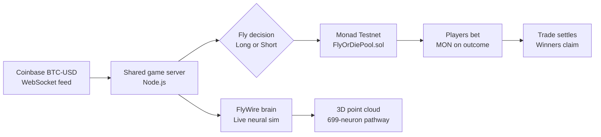
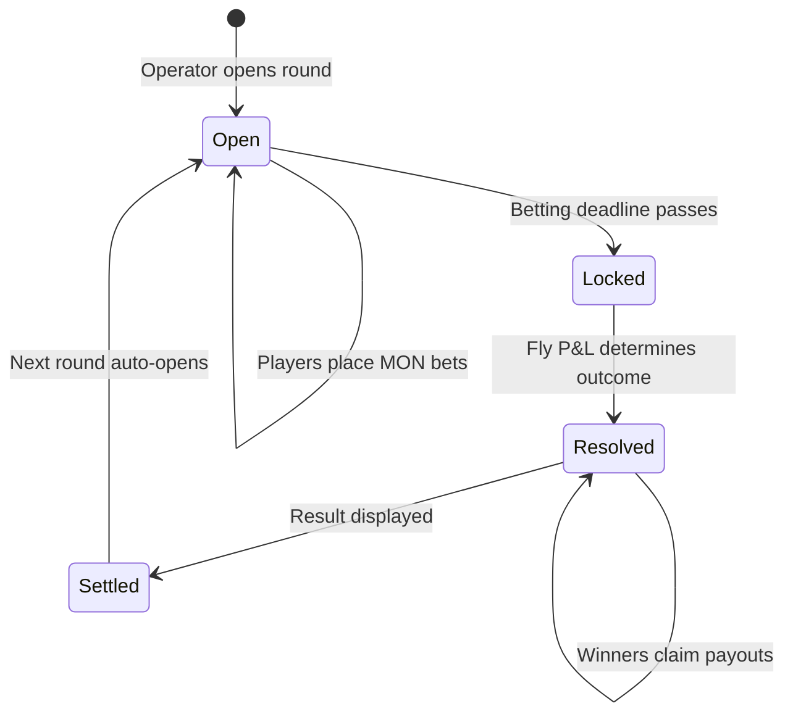
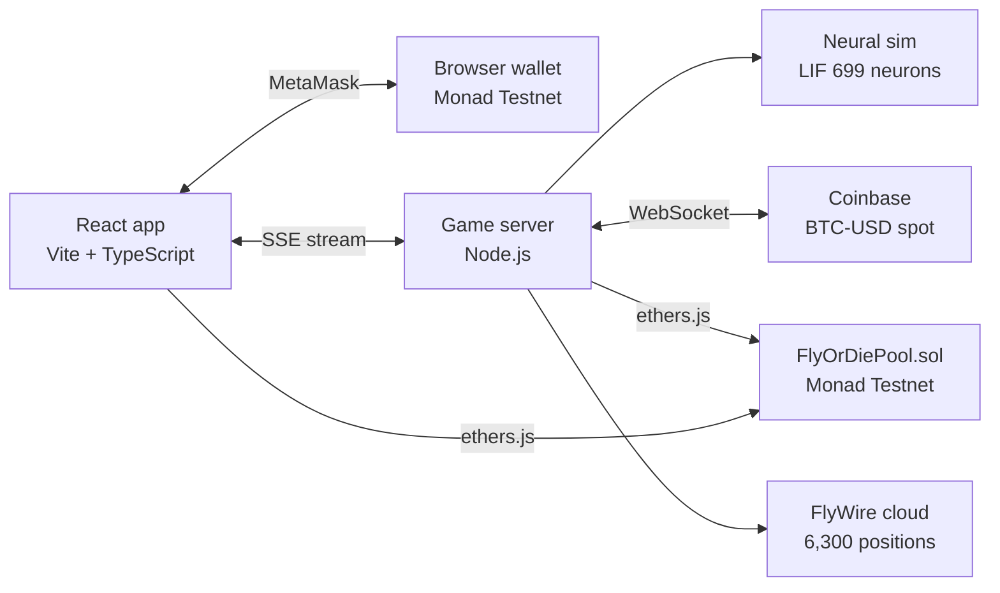

<p align="center">
  
</p>

<h1 align="center">FlyOrDie — Rekt or Rich</h1>

<p align="center">
  <b>A shared prediction game where a fly trades BTC — and degens bet on the outcome.</b>
</p>

<p align="center">
  FlyOrDie takes a real-time Coinbase BTC-USD market feed, lets a connectome-inspired fly decide whether to go long or short, and opens the outcome to on-chain prediction bets on Monad Testnet.<br/>
  One shared server runs the round clock and neural simulation for every connected player. Real MON bets are placed from each wallet directly on the smart contract.
</p>

<p align="center">
  <a href="#run-locally">Run Locally</a> ·
  <a href="#deploy-the-contract">Deploy Contract</a> ·
  <a href="#architecture">Architecture</a> ·
  <a href="#flywire-brain-display">Brain Display</a>
</p>

<p align="center">
  
  
  
  
  
  
</p>

---

## The problem

Prediction markets are often abstract dashboards disconnected from any real-world event. Users place bets on numbers, wait, and check results in a separate interface. Meanwhile:

| Friction | What it causes |
| --- | --- |
| **Disconnected experience** | The thing you bet on and the result you watch live in different places. There is no shared visual event. |
| **No shared context** | Each player stares at the same static UI alone. There is no communal heartbeat, no live swarm energy. |
| **Opaque resolution** | Many prediction games resolve via hidden oracles. Players cannot see the decision process unfold in real time. |

---

## The FlyOrDie solution

FlyOrDie is a working prediction game where **the live market event, the decision process, and the on-chain bet share the same screen**.

- A fruit fly watches the real-time BTC-USD market and autonomously opens a long or short paper trade.
- Players predict whether the fly's trade will be **profitable (Epic Gains)** or **liquidated (Rekt)** before the position closes. A disclosed 0.05% simulated round-trip cost is deducted; only positive net P&L counts as a fly win.
- MON bets are placed directly on a Monad Testnet smart contract; winners split the losing pool proportionally.
- A 6,300-neuron FlyWire brain visualization renders the fly's live neural activity above the game — a connectome-inspired sensory simulation running continuously on the server.
- One shared Node.js server broadcasts the same fly, the same round clock, and the same brain to every connected player. No one sees a different game.

> **FlyOrDie does not hide the prediction behind a number. It makes the live market, the neural decision, and the bet part of one shared visual experience.**

### Traditional prediction game vs. FlyOrDie

| Typical prediction game | FlyOrDie |
| --- | --- |
| **Market source** | Abstract price feed or synthetic event displayed as text. | Live Coinbase BTC-USD 1-minute candle chart with real-time WebSocket ticker updates. |
| **Decision agent** | Hidden oracle or random number generator. | An animated SVG fly that opens a visible long/short BTC position based on a connectome-inspired decision model. |
| **Visual experience** | Static UI with countdown timers. | Animated fly, live candlestick chart, 3D brain point cloud, real-time neural firing activity, and shared chat. |
| **Shared state** | Each player sees their own isolated view. | One server-authoritative simulation; all players watch the same fly, same round, same brain. |
| **Settlement** | Backend resolves results. | Solidity contract on Monad Testnet with transparent pool mechanics and on-chain events. |
| **Community** | Disconnected leaderboards. | Live chat swarm, shared activity feed, and connected player count. |



---

## How a round works

### 01 — Market opens

The server connects to the Coinbase BTC-USD WebSocket feed and waits for a stable price. When the feed is live, the fly opens a paper long or short position at the current spot price.

### 02 — Betting window

The operator opens a Monad round with a configurable deadline (default 30 seconds). Players connect their MetaMask wallet to Monad Testnet and place MON bets on **EPIC GAINS** or **LIQUIDATED**.

### 03 — Position settles

When the betting deadline passes, the operator locks the round on-chain. The server records the BTC-USD closing price, calculates directional gross P&L, then deducts a fixed 0.05% simulated round-trip cost. Only positive net P&L is an Epic Gains result.

### 04 — Result and payout

The operator publishes the outcome to the contract. Winners claim their stake plus a proportional share of the losing pool. The next round opens automatically — claims do not hold up round progression.



---

## Product surface

FlyOrDie is more than a bet button. Every element on screen is connected to the shared game state:

| Component | Behavior | Connection |
| --- | --- | --- |
| **BTC-USD candlestick chart** | Real-time 1-minute Coinbase candles with volume bars, entry/exit lines, and live ticker | Determines the fly's P&L and round outcome |
| **Animated SVG fly** | Hover, dodge, dive, gains, and liquidated animations with neon styling | Reflects the current phase and trade result |
| **Fly position chip** | Shows LONG/SHORT, entry price, and live P&L percentage | Tracks the fly's open paper trade |
| **Prediction pools** | Dual-bar pool visualization with real-time MON totals and percentages | Reads from on-chain `liquidatedPool` and `gainsPool` |
| **FlyWire brain panel** | 6,300-point 3D cloud with group toggles, connections, and auto-rotation | Streams live neural firing from the server's LIF simulation |
| **Live activity feed** | On-chain `BetPlaced` events, round transitions, and operator status | Subscribes to contract event logs and SSE game events |
| **Swarm chat** | Shared chat room with wallet-derived names and message persistence | Broadcast via the shared game server to all connected players |
| **Wallet & claims** | Connect, bet, claim one round, or batch-claim up to 50 rounds in one tx | Direct contract interaction via ethers.js and MetaMask |
| **Operator status** | Real-time display of operator readiness, RPC health, and round automation | Server validates operator wallet against contract and reports status |

---

## FlyWire brain display

The panel above chat renders **6,300 measured soma or anchor positions** from FlyWire's FAFB v783 neuron annotations as an interactive 3D point cloud. Colors identify annotated groups; drag to rotate, use the wheel to zoom, click a modeled cell to inspect it, and toggle groups or connections.

The live overlay shows the current firing activity of the selected **699-neuron, 4,199-connection visual pathway** (LC10a → AOTU → DNa). The server advances this sensory leaky integrate-and-fire simulation continuously and streams its current state; the view does not replay a short saved trace.

| Data source | Reference |
| --- | --- |
| **Connectome graph** | [Drosophila brain model — Shiu et al. 2024](https://www.nature.com/articles/s41586-024-07763-9) |
| **Neuron annotations** | [FlyWire annotations (flywire_annotations)](https://github.com/flyconnectome/flywire_annotations) |
| **Brain model data** | [Drosophila brain model repository](https://github.com/philshiu/Drosophila_brain_model) |

The simulation uses leaky integrate-and-fire dynamics with parameters from the published model:

| Parameter | Value |
| --- | --- |
| Membrane time constant | 20 ms |
| Synaptic time constant | 5 ms |
| Refractory period | 2.2 ms |
| Resting potential | −52 mV |
| Threshold potential | −45 mV |
| Weight per synapse | 0.275 mV |
| Synaptic delay | 1.8 ms |
| Simulation step | 0.1 ms |

> This is not a full-brain simulation or a scientifically validated fly behavior model. The 699-neuron pathway is a selected visual circuit; only a live ambient sensory input drives the displayed activity. The round's sealed game outcome remains a separate deterministic calculation.

---

## Smart contract

The `FlyOrDiePool.sol` contract has a deliberately minimal operator surface:

| Function | Authority | Result |
| --- | --- | --- |
| `openRound(closesAt)` | Operator | Creates a new betting window with an on-chain deadline |
| `placeBet(roundId, gains)` | Any player | Accepts native MON; `true` = Epic Gains, `false` = Liquidated |
| `lockRound(roundId)` | Operator | Locks the pool after the betting deadline |
| `resolveRound(roundId, gainsWon)` | Operator | Publishes the observed outcome |
| `claim(roundId)` | Winner | Claims stake + proportional share of the losing pool |
| `claimMany(roundIds[])` | Winner | Batch-claims up to 50 resolved rounds in one transaction |

If nobody backed the winning side, every participant can reclaim their full stake. Integer division can leave a small rounding remainder in the contract. The contract is initialized with a fixed operator address and contains no fee extraction or hidden administrative path.

---

## Why Monad

Monad gives FlyOrDie the speed and cost properties that make short prediction rounds viable:

| Monad capability | How FlyOrDie uses it |
| --- | --- |
| **Fast block times** | 30-second betting windows settle without the UX latency of slower chains |
| **Low gas costs** | Players can place small testnet MON bets without prohibitive transaction fees |
| **EVM compatibility** | Standard Solidity contract, Hardhat tooling, and ethers.js integration |
| **MetaMask support** | Players connect with a familiar wallet; the app adds the Monad Testnet chain automatically |
| **Public RPC** | Both the server operator and browser clients read contract state from the same public endpoint |

---

## Architecture



### What runs on the server

- Coinbase BTC-USD WebSocket feed and 1-minute candle history
- Leaky integrate-and-fire neural simulation (699 neurons, 4,199 connections)
- Round automation: `openRound` → `lockRound` → `resolveRound` → next round
- Shared game state broadcast via Server-Sent Events
- Chat relay and activity feed aggregation

### What runs in the browser

- Real-time candlestick chart with entry/exit markers
- Animated SVG fly with phase-based motion
- 3D WebGL point cloud for the FlyWire brain visualization
- MetaMask wallet connection, bet placement, and payout claims
- Contract event subscription for live `BetPlaced` logs

---

## Run locally

### Requirements

- Node.js 22.5 or newer
- npm
- MetaMask configured for Monad Testnet (Chain ID `10143`, RPC `https://testnet-rpc.monad.xyz`)
- A Monad Testnet wallet with MON for gas (operator) and betting (player)

### Quick start

```bash
git clone https://github.com/sameterguc/FlyNads.git
cd FlyNads
npm install
cp .env.example .env.local
```

### Window 1 — Game server and automatic round operator

Enter your test operator wallet private key securely, then start the server:

```powershell
$secureKey = Read-Host "Test wallet private key" -AsSecureString
$ptr = [Runtime.InteropServices.Marshal]::SecureStringToBSTR($secureKey)
try {
  $env:MONAD_PRIVATE_KEY = [Runtime.InteropServices.Marshal]::PtrToStringBSTR($ptr)
} finally {
  [Runtime.InteropServices.Marshal]::ZeroFreeBSTR($ptr)
}
npm run server
```

The server checks that this wallet is the contract's operator. It opens a round if needed, locks it when betting ends, resolves the fly outcome, then starts another round automatically. Visit `http://localhost:8788/api/health` and confirm `operator.ready` is `true`.

### Window 2 — Web app

```powershell
npm run dev
```

Open the Vite URL (normally `http://localhost:5174`). For local network play, use the host machine's `Network` IP instead of `localhost`.

---

## Deploy the contract

```powershell
$secureKey = Read-Host "Test wallet private key" -AsSecureString
$ptr = [Runtime.InteropServices.Marshal]::SecureStringToBSTR($secureKey)
try {
  $env:MONAD_PRIVATE_KEY = [Runtime.InteropServices.Marshal]::PtrToStringBSTR($ptr)
} finally {
  [Runtime.InteropServices.Marshal]::ZeroFreeBSTR($ptr)
}
npm run contract:compile
npm run contract:deploy:testnet
```

Copy the deployed address and update `.env.local`:

```dotenv
VITE_CONTRACT_ADDRESS=NEW_DEPLOYED_ADDRESS
VITE_LEGACY_CONTRACT_ADDRESSES=0x5202e57A5e20976A670D1e75d1c9f8d3BDDedC01
MONAD_CONTRACT_ADDRESS=NEW_DEPLOYED_ADDRESS
```

Keep `MONAD_PRIVATE_KEY` out of every `VITE_*` variable. `.env.local` is ignored by Git. The server reads the two `MONAD_*` values from its own process environment; neither is sent to the browser.

---

## Configuration

| Variable | Scope | Purpose |
| --- | --- | --- |
| `VITE_CONTRACT_ADDRESS` | Browser | Active FlyOrDiePool contract address |
| `VITE_LEGACY_CONTRACT_ADDRESSES` | Browser | Comma-separated old contract addresses for claim history |
| `VITE_ROUND_ID` | Browser | Starting round ID (default `1`) |
| `MONAD_PRIVATE_KEY` | Server only | Operator wallet private key (never exposed to browser) |
| `MONAD_CONTRACT_ADDRESS` | Server only | Contract address for operator transactions |
| `FLY_BET_SECONDS` | Server only | Betting window duration in seconds (default `30`) |
| `PORT` | Server only | Game server port (default `8788`) |
| `VITE_PORT` | Dev only | Vite dev server port (default `5174`) |
| `FLYORDIE_SERVER_PORT` | Dev only | API proxy target port (default `8788`) |

---

## Repository map

```
src/
├── App.tsx                    Three-column game interface, wallet, betting, claims
├── LiveFly.tsx                Animated SVG fly with phase-based motion
├── FlyBrainPanel.tsx          3D brain panel with live neural activity overlay
├── BrainCloudCanvas.tsx       WebGL point cloud renderer and neuron interaction
├── BtcCandlestickChart.tsx    Real-time Coinbase BTC-USD candlestick chart
├── chain.ts                   Monad wallet, contract reads, bets, and claims
├── game-engine.ts             Connectome-inspired decision model and outcome logic
├── shared-game.ts             SSE client for the shared game server
├── brain-stream.ts            Live neural frame store for streamed brain activity
├── market-types.ts            BTC market and fly trade type definitions
└── data/
    ├── flywire-brain-cloud.json       6,300 FlyWire soma positions and groups
    └── flywire-vision-circuit.json    699-neuron FAFB v783 visual pathway

server/
├── server.mjs                 Shared game server, round operator, chat, and API
├── neural-brain.mjs           Leaky integrate-and-fire simulation engine
└── btc-market.mjs             Coinbase WebSocket feed and candle aggregation

contracts/
└── FlyOrDiePool.sol           Monad Testnet prediction pool contract

scripts/
├── deploy.cjs                 Hardhat contract deployment
├── manage-round.cjs           Manual round operator commands
├── build-neural-circuit.mjs   Regenerate the compact vision circuit graph
└── build-brain-cloud.mjs      Rebuild the 6,300-point FlyWire cloud
```

---

## Technology stack

| Layer | Technology |
| --- | --- |
| **Frontend** | React 19, TypeScript 5.8, Vite 6 |
| **Styling** | Custom CSS with CSS variables, neon dark theme, spotlight hover effects |
| **Fly animation** | Inline SVG with CSS keyframe animations — no image assets required |
| **Charts** | Hand-built SVG candlestick renderer with Coinbase data |
| **3D visualization** | Raw WebGL point cloud with group filtering and neural activity overlay |
| **Blockchain** | Solidity 0.8.24, Hardhat, ethers.js 6 |
| **Network** | Monad Testnet (Chain ID 10143) |
| **Market data** | Coinbase Pro WebSocket API (`wss://ws-feed.exchange.coinbase.com`) |
| **Neuroscience** | FlyWire FAFB v783 annotations, Shiu et al. 2024 LIF parameters |
| **Server** | Node.js with native HTTP, Server-Sent Events |
| **State sync** | SSE for game state, brain frames, chat; contract events for bets |

---

## Trust model and scope

FlyOrDie is a hackathon MVP running on **Monad Testnet**. Important boundaries:

- The round operator controls `openRound`, `lockRound`, and `resolveRound`. The contract trusts the outcome supplied by the operator — this is not a trustless oracle.
- Bets and payouts use testnet MON only; this is hackathon testnet code, not a production wagering system.
- The BTC-USD position is a paper trade — no real BTC order is placed on any exchange.
- The neural simulation is a connectome-inspired visualization, not a scientifically validated fly behavior model.
- The server stores only the current simulation seed and phase in the ignored `.flyordie-round.json` file so a restart can resume the same round.
- Pull claims do not hold up round progression. If nobody backed the winning side, all players can reclaim their stakes.
- Before real-value deployment, the result source, operator controls, dispute/recovery flows, contract security, and applicable regulations need separate design and review.

---

**Built for the Monad Hackathon 2026**

One fly. One market. One shared round. Rekt or Rich.
